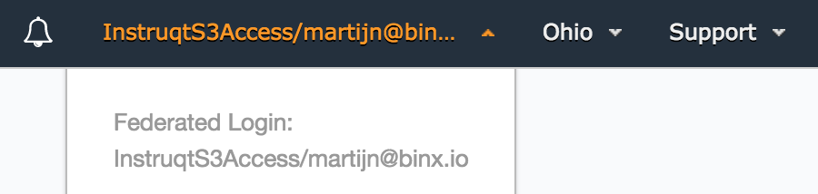

**\*\*This is the source code for https://binx.io/blog/2018/01/09/generate-temp-aws-credentials \*\***

# Generate temporary user access for AWS

For our product Instruqt, we're building challenges to learn AWS technology. Users of instruqt need to have temporary access to create, update and destroy their resources in AWS. We would like to give the users the experience of having their own AWS account. Access keys to use in the CLI or programmatic access, and the Management Console in the browser. This blog post describes how to prepare an AWS account for this usage, and how to generate and use temporary access keys, and a magic link to the management console.

## Prerequisites

* **AWS Account**. You need to have an AWS Account, with a user and access keys with permissions to list, read, create, update and delete IAM groups, users, roles and policies.
* **Terraform**. You need to have installed Terraform.
* **Python**. Ensure you have a recent python version with pip. On a mac I recommend this [setup](http://sourabhbajaj.com/mac-setup/Python/).
* **AWS CLI**. Install the AWS CLI with pip. (`pip install awscli --upgrade --user`)
* **Keybase**. Install and create a Keybase account ([https://keybase.io/](https://keybase.io/)

## Roles and Federation

Besides common entities like users and groups, AWS provides "roles". A role in AWS could for example be assigned to a server, which allows software running on the server to access AWS resources. A role can also be assumed by a user, giving him access to the resources. Also known as "federation". A role contains two types of policies. One policy which describes the type of the service allowed to assume the role (an ec2 instance or an AWS account with users). The other policy describes the permission level to the specified resources. 

For this use case we create a role which can be assumed by an AWS IAM User. Just a trust is not enough, the user also needs to have permissions to assume the role with AssumeRolePolicy. After the role is assumed, the AccessPolicy permissions are temporarliy given to the user by sending a set of keys. 

```
+------------------+
|                  |
|       User       <-----------+
|                  |           |
+---------+--------+           |
          |                    |
          | AssumeRolePolicy   | TrustPolicy
          |                    |
+---------v--------+           |
|                  |           |
+       Role       +-----------+
|                  |
+---------+--------+
          |
          | AccessPolicy 
          |
+---------v--------+
|                  |
+     Resources    |
|                  |
+---------+--------+
```

## Setup

To setup the user, role, policies etc, you could use CloudFormation, Terraform, the CLI or the Management Console. In this example I've used Terraform, but you could easily use this as documentation to do it manually, or using CloudFormation. 

Create `setup.tf` using the following source. You won't have to change anything, but it's recommended to read and search in the terraform documention what exactly happens.

```
# CONFIGURATION AND PARAMETERS

variable "aws" {
  description = "Enter the aws profile to deploy."
}

variable "keybase" {
  description = "Enter the keybase profile to encrypt the secret_key (to decrypt: terraform output secret_key | base64 --decode | keybase pgp decrypt)"
}

variable "region" {
  default = "eu-west-1"
}

provider "aws" {
  profile    = "${var.aws}"
  region     = "${var.region}"
}

data "aws_caller_identity" "current" {}

# RESOURCES

resource "aws_iam_user" "instruqt" {
  name = "instruqt"
}

resource "aws_iam_access_key" "instruqt" {
  user = "${aws_iam_user.instruqt.name}"
  pgp_key = "keybase:${var.keybase}"
}

resource "aws_iam_user_policy" "instruqt_assume_role" {
  name = "test"
  user = "${aws_iam_user.instruqt.name}"

  policy = <<EOF
{
  "Version": "2012-10-17",
  "Statement": [
    {
      "Action": [
        "sts:Assume*"
      ],
      "Effect": "Allow",
      "Resource": "*"
    }
  ]
}
EOF
}

resource "aws_iam_role" "S3AccessRole" {
  name = "InstruqtS3Access"
  assume_role_policy = <<EOF
{
  "Version": "2012-10-17",
  "Statement": [
    {
      "Action": "sts:AssumeRole",
      "Principal": {
        "AWS": "arn:aws:iam::${data.aws_caller_identity.current.account_id}:root"
      },
      "Effect": "Allow",
      "Sid": ""
    }
  ]
}
EOF
}

resource "aws_iam_role_policy" "S3AccessPolicy" {
  name = "InstruqtS3AccessPolicy"
  role = "${aws_iam_role.S3AccessRole.id}"
  policy = <<EOF
{
  "Version": "2012-10-17",
  "Statement": [
    {
      "Action": [
        "s3:*"
      ],
      "Effect": "Allow",
      "Resource": "*"
    }
  ]
}
EOF
}

# OUTPUT

output "role_arn" {
  value = "${aws_iam_role.S3AccessRole.arn}"
}
output "access_key" {
  value = "${aws_iam_access_key.instruqt.id}"
}
output "secret_key" {
  value = "${aws_iam_access_key.instruqt.encrypted_secret}"
}
```

Deploy the stack using the following commands. Select one of the profiles configured in `~/.aws/credentials`.

```
terraform init
terraform apply
```

When Terraform has completed, the output contains access keys for the next steps. The secret key is encrypted with keybase. Decrypt the generated secret key using the next command:

```
terraform output secret_key | base64 --decode | keybase pgp decrypt
```

## Run the python generate_keys.py

First install dependencies with for example pip, using the next example.

```
pip install requests boto3
```

Create a file `generate_keys.py` with the following source:

```python
import urllib, json, requests, sys, boto3

if len(sys.argv[1:]) != 3:
    print 'use: python generate_keys.py session_name role_arn output_format'
    exit(1)
else:
    session_name = sys.argv[1]
    role_arn = sys.argv[2]
    output = sys.argv[3]

sts_connection = boto3.client('sts')

assumed_role_object = sts_connection.assume_role(
    RoleArn=role_arn,
    RoleSessionName=session_name
)

json_string_with_temp_credentials = '{'
json_string_with_temp_credentials += '"sessionId":"' + assumed_role_object['Credentials']['AccessKeyId'] + '",'
json_string_with_temp_credentials += '"sessionKey":"' + assumed_role_object['Credentials']['SecretAccessKey'] + '",'
json_string_with_temp_credentials += '"sessionToken":"' + assumed_role_object['Credentials']['SessionToken'] + '"'
json_string_with_temp_credentials += '}'

request_parameters = "?Action=getSigninToken"
request_parameters += "&SessionDuration=43200"
request_parameters += "&Session=" + urllib.quote_plus(json_string_with_temp_credentials)
request_url = "https://signin.aws.amazon.com/federation" + request_parameters
r = requests.get(request_url)
signin_token = json.loads(r.text)

request_parameters = "?Action=login" 
request_parameters += "&Issuer=Instruqt" 
request_parameters += "&Destination=" + urllib.quote_plus("https://console.aws.amazon.com/")
request_parameters += "&SigninToken=" + signin_token["SigninToken"]
request_url = "https://signin.aws.amazon.com/federation" + request_parameters

parsed = {}

parsed['access_key'] = assumed_role_object['Credentials']['AccessKeyId']
parsed['secret_key'] = assumed_role_object['Credentials']['SecretAccessKey']
parsed['session_token'] = assumed_role_object['Credentials']['SessionToken']
parsed['console_access'] = request_url

if output == 'credentials':
    print "[tmpinstruqt]"
    print "aws_access_key_id = " + assumed_role_object['Credentials']['AccessKeyId']
    print "aws_secret_access_key = " + assumed_role_object['Credentials']['SecretAccessKey']
    print "aws_session_token = " + assumed_role_object['Credentials']['SessionToken']

elif output == "link":
    print request_url

else: 
    print json.dumps(parsed, indent=4)
```

generate_keys.py requires 3 parameters:

* **session_name**. The session name is an unique ID of the user who is going to use the temporary credentials. (Example: martijn@binx.io)
* **role_arn**. The role arn is part of the output of the terraform script. (Example: arn:aws:iam::AWS\_ACCOUNT\_ID:role/InstruqtS3Access). You can copy this from the output of terraform.
* **output_format**. This could only contain: json | credentials | link

generate_keys.py uses Boto (AWS SDK for Python). It will use environment variables for access keys. Copy the access\_key output from terraform and the decrypted secret\_key and replace the environment variables in the example below. 

```
AWS_ACCESS_KEY_ID=AKIA34K435KLR12KDT345 \
AWS_SECRET_ACCESS_KEY=lk45hJSFkl35ADfsdDFtkl34fFADFhlktjrfaewr \
python ./generate_keys.py martijn@binx.io arn:aws:iam::AWS_ACCOUNT_ID:role/InstruqtS3Access json
```
The output of this command should look similar to:

```
{
    "access_key": "ASIDF45H4K53TLWQ3234", 
    "secret_key": "4k2h4kl234lk23j42lk34j23lk4j23kl4j", 
    "console_access": "https://signin.aws.amazon.com/federation?Action=login&Issuer=Instruqt&Destination=https%3A%2F%2Fconsole.aws.amazon.com%2F&SigninToken=k4j53kl45h3l4k5h3jl4h5234lk2j23k4j234...", 
    "session_token": "lerthDFSDFwle2k34jlkLKJkjrthlewkjrKLDFthwlek..."
}
```

If you get an error with at the end of the stack trace the message: "The security token included in the request is invalid." It's probably because you didn't replace the values of  AWS\_ACCESS\_KEY\_ID and AWS\_SECRET\_ACCESS\_KEY. 

## Use the generated temporary keys

### With a browser
Open a browser and copy the "console_access" magic link. You're automatically logged on.



### With the CLI

There are several ways to use the temporary credentials. To add the credentials once and easily use it in next commands, you can create a new profile in `~/.aws/credentials`. After the profile is added to credentials, you can use it with `--profile tmpinstruqt` in the AWS CLI.

```
AWS_ACCESS_KEY_ID=AKIA34K435KLRET345 \
AWS_SECRET_ACCESS_KEY=lk45hJSFkl35fLKHDetkl34fFADFhlktjrfaewr \
python ./generate_keys.py martijn@binx.io arn:aws:iam::AWS_ACCOUNT_ID:role/InstruqtS3Access credentials
[tmpinstruqt]
aws_access_key_id = AKIA34K435KLRET345
aws_secret_access_key = lk45hJSFasdfkl35fLKHDl34fFADFhlktjrfaewr
aws_session_token = 45j3lk44k23lk23lk423grgpp43wmSDmvmxcj34h5k3j4...
```

```
aws s3 ls --profile tmpinstruqt
```

### Programmatic access

And you can of course use these credentials for programmatic access. This is not the recommended way of adding secrets in your code, but just for this example hard coded.

```python
import boto3
client = boto3.resource(
    's3',
    aws_access_key_id='ASIAL34H2K3423KL4JLKJLKJ',
    aws_secret_access_key='e0hvLM234LKJ23KDAdsf23DFAXiBrNu8Ht',
    aws_session_token='F4adsJL2sdafK3J42K3LJ4erg2K3J4....',
)
for bucket in client.buckets.all():
    print(bucket.name)
```

## Final words

Now everything is setup and tested, just try to make it awesome. Give the temporary users more permissions to do other stuff than S3, generate and use the new keys in the CLI, scripts or using the Management Console. 

To clean up, just remove the temporary credentials from your `~/.aws/credentials`, and `clear` the terminal. Run `terraform destroy` to remove the AWS setup. 

You can download the source from github: https://github.com/binxio/generate-temp-aws-credentials

Feel free to contact me if you have any questions. Your feedback is appreciated, and will be used to improve this blog post and future posts.
